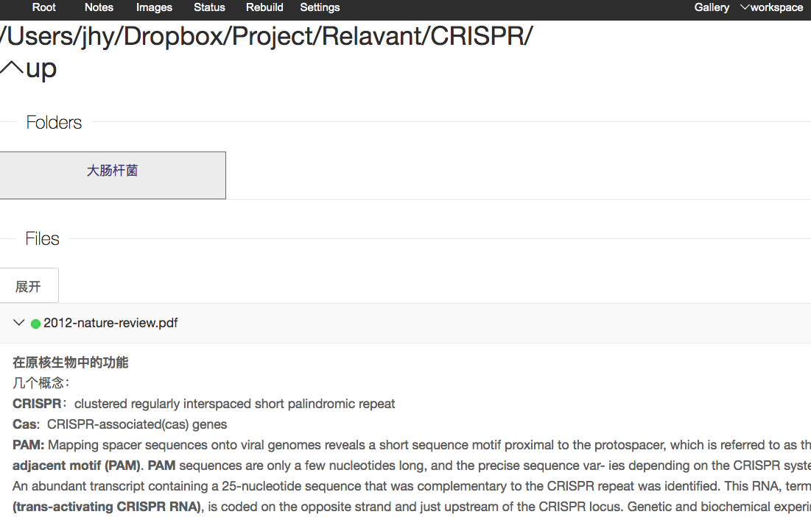

# Filegai : A local database for taking notes for the of local files

## Why do I need another note database?
As a molecular biology technician, I have lots of literatures (most of them are PDF files) on my local drive. Usually, these files will be read and left with highlighting marks, which I call them biological marks. I found myself always forget where my knowlege of something came from, from which file to be specifically.From time to time, a quick check of the papers is necessary.

Also, when we did experiments, data files from diefferent machines are usually of software specific format. And we will do some repeat.  

If we have left some note on the file, life would be easier, I think.

Nowadays, lots of cloud service companies have Notes plans. Myself use OneNote. These softwares are quite convenient. Having to pay annually does not annoy me much since I have to rely on Office to do the work, they are bundled together. What I want is to bundle FILES and NOTES. I did not find good product on the market.

## Why it is called Filegai?
I wanted to call it File-guide, which is quite self-explainatory, but the name is taken by other software. So I call it File-gai, with similar pronunciation, no one else will took this name when I did the google search. So, it's unique, and will not be mixed with others. 

## What it can do?
This program starts a web server, basically it just lists the files in the serving folder. You can add note to the files. The notes will be stored in a Sqlite3 database. The database files are in you control. You can copy,open,and edit the file i you need. The note can hold images, which are also stored in the Sqlite3 database. You can back trace the file and note containing the image based on a image list view. As long as you hold control of the database file, the notes are portable and will always be your own property.

When you click on the some file name, the system will open the file with the original program ( on Mac, PDF will be open by Preview).  Some files like programming codes, the browser will display the file with syntax highlight.

If you put your note database in a Dropbox folder, and the serving folder is also in Dropbox folder, the notes will be synchronized across PCs. If you use the system for a long time, the database file will become too big for synchronizing folders like DROPBOX. A little change to the note will cause the whole database to be uploaded to the Dropbox folder. So, the I seperated Text and Image resources into different files, each no bigger than 50 MB. That will make the synchronizing easier.

## How it looks like
**Before expanding notes**


**After expanding the notes**


**All the images in the notes are trackable**


**When Adding Notes**


## What technology it use?
This program is based on several open source projects. Originally, Filegai was written in Ruby, and used sinatra as web framework. During the COVID19 outbreak lockdown in Shanghang(2022.April), I re-wrote the program in Golang. Because Golang can pack everything in a single binary file, some people may want to try out but don't want to get into the trouble of installing the whole Ruby enviroment. I love Ruby though, Golang program seems more portable. This project is based on the following Open Source projects
1. Go: An modern C like programming language.
2. Gin: A simple and mighty web framework written in Go.
3. Sqlite3: An excellent open source database management software.
4. The Sqlite3 driver and the to Golang.
5. TinyMCE: An elegant web based WYSIWYG html editor.
6. Layui: A fantastic javascript library for amateur web desgin like me.
6. Jquery: A versatile Javascript library.

## How the Database is organized?
The picture below illustrats the database on my computer. I will explain later if necessary.


## How to use this program
1. Download the zip package, and unpack it to somewhere, for example unpack it to home directory in Mac OS
2. Make sure the location of your `files` that will be served in the program, and choose a Folder name for storing the note database
3. Start the program by providing the folder names. Open terminal and put in the command like the below example.
4. Open you web browser(Chrome of Firefox) and go to http://localhost:8080/, note the port can be changed.

```bash
# example code
# download the file to /Users/jhy/Filegai.zip
unzip Filegai.zip
cd Filegai
./Filegai -n -d /Users/jhy/Dropbox/Projects/Filegai/ -p 7070 /Users/jhy/Dropbox/Projects/
# use -n when you first use this program, it will create the folder in the -d option
# later on don't use -n
# -p 7070, http port is at 7070
# /Users/jhy/Dropbox/Projects/  is the files that I want to make note of 

# access by visiting http://localhost:7070
```

## Binary Files

1. [Mac( built on Mojave) on my website](Filegai_mac.zip), or [on my web site](http://www.easyseq.com/tmp/Filegai_mac.zip)
2. [Windows( built on Windows 10)](./Filegai_win.zip), or [on my web site](http://www.easyseq.com/tmp/Filegai_win.zip)


